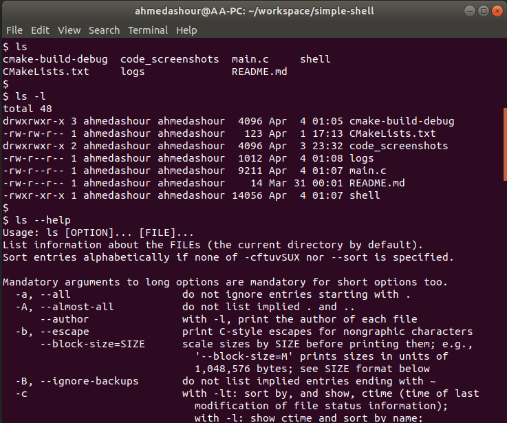
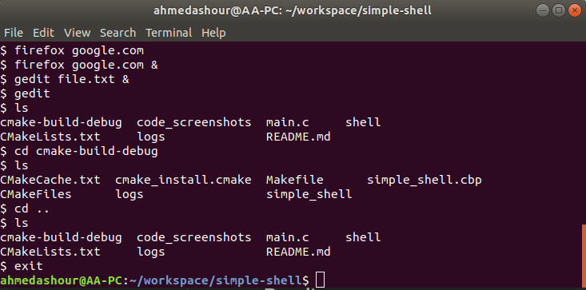
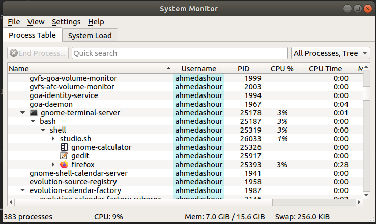

# Simple Shell

A shell is a program that takes commands from the keyboard and
gives them to the operating system to perform. So it provides you
with an interface to the Unix system. 

## Features

- All basic shell commands in linux including:
	- Commands with no arguments
	- Commands with arguments
- Execute commands in background using &
- Logs

## Usage

1. Clone this repo
2. Navigate to `simple-shell`  folder
```bash
$ cd simple-shell
```
3. Compile (using gcc compiler here, use your favourite)
```bash
$ gcc -o shell main.c
```
4. Run
```bash
$ ./shell
```
## Structure

### Running the Shell

This is shell's entry point; as it loops to execute the user commands and then makes sure to free up the memory used dynamically at runtime. It exits only when the user uses `exit` command or in case of unexpected error.

The `run` function executes the following steps in a loop:

1. Takes user input.
2. Parses the user input into an understandable command and arguments (if exists).
3. Checking the arguments to know whether to execute the command in background or not if ampersand `&` exists.
4. Executes user command.
5. Deallocate the memory used by the program's variables.


### Commands Execution

There are two different types of commands, the first is the system commands which can be directly sent to `exec` function to execute them, and the second are commands that are built-in the program such as `cd` and `exit`.

First of all, we call the `check_command` function from main to know which type of command the user entered; in `check command` function we loop through our built-in command to see if there is a match. 

If one matches, we execute the corresponding function to call the appropriate system call and make any needed adaptation.


If not, then we delegate the work to `execute_commands` function passing the `args` array which contains the command and its arguments along with `background` variable which specifies if the command to be run in the background or not.

In `execute_commands` function, we do a couple of things:

1. Instantiate signal handler to handle SIGCHLD signals sent by terminated children.
2. Do the forking; if successful, we pass the command and its arguments to `execvp` system call which is a variant of  `exec` family.
3. For the parent process, we wait for the child to terminate if not executed in background


### Logging

Logging is simple, when a child terminates, we log its `pid` in `logs.txt` file.


## Sample Runs







